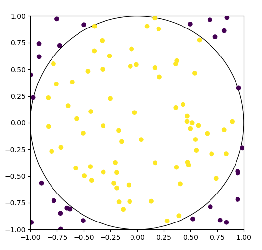
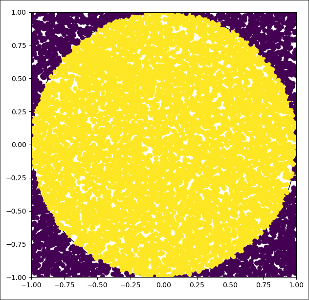
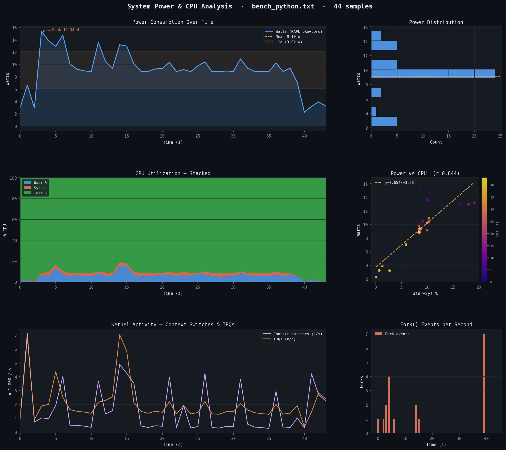
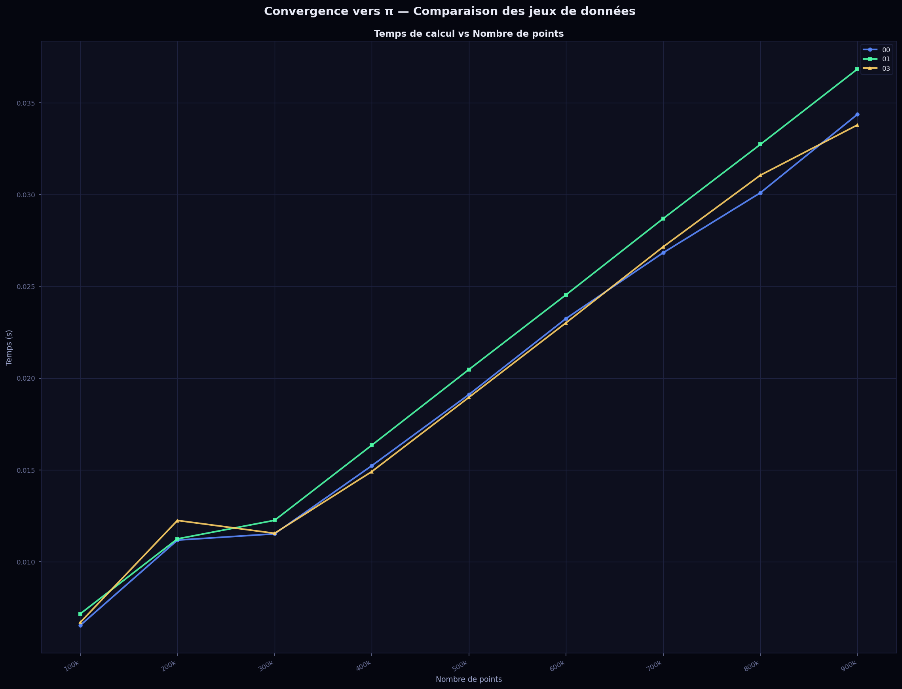
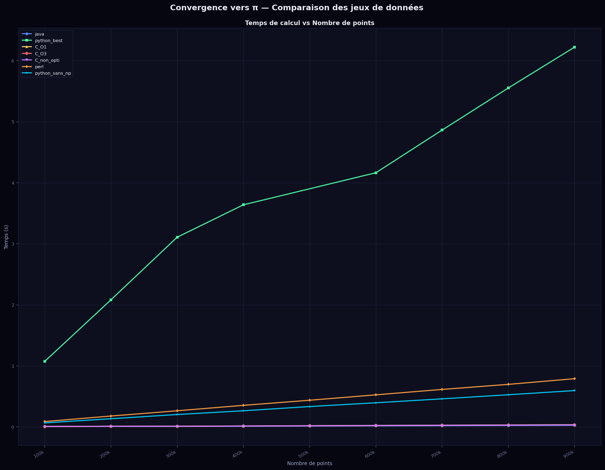
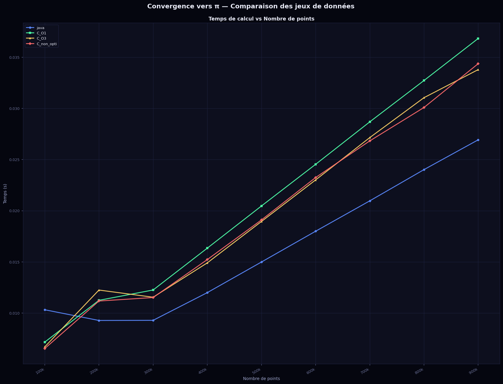

# Comparaison énergétique des différents langages de programmation
Siboni--Bergard Maxence et Nicolas Bouydron

## Caractéristique de la machine de test
```
          ▗▄▄▄       ▗▄▄▄▄    ▄▄▄▖             maxx@laptop-nixos1
          ▜███▙       ▜███▙  ▟███▛             ------------------
           ▜███▙       ▜███▙▟███▛              OS: NixOS 25.11 (Xantusia) x86_64
            ▜███▙       ▜██████▛               Host: 82EY (IdeaPad Gaming 3 15ARH05)
     ▟█████████████████▙ ▜████▛     ▟▙         Kernel: Linux 6.12.76
    ▟███████████████████▙ ▜███▙    ▟██▙        Uptime: 1 hour, 22 mins
           ▄▄▄▄▖           ▜███▙  ▟███▛        Packages: 1905 (nix-system), 1712 (nix-user)
          ▟███▛             ▜██▛ ▟███▛         Shell: bash 5.3.3
         ▟███▛               ▜▛ ▟███▛          Display (LGD06B8): 1920x1080 in 15", 60 Hz [Built-in]
▟███████████▛                  ▟██████████▙    WM: Hyprland 0.53.3 (Wayland)
▜██████████▛                  ▟███████████▛    Cursor: Adwaita (24px)
      ▟███▛ ▟▙               ▟███▛             Terminal: kitty 0.44.0
     ▟███▛ ▟██▙             ▟███▛              Terminal Font: JetBrainsMonoNFM-Regular (16pt)
    ▟███▛  ▜███▙           ▝▀▀▀▀               CPU: AMD Ryzen 5 4600H (12) @ 3.00 GHz
    ▜██▛    ▜███▙ ▜██████████████████▛         GPU 1: NVIDIA GeForce GTX 1650 Ti Mobile [Discrete]
     ▜▛     ▟████▙ ▜████████████████▛          GPU 2: AMD Radeon Vega Series / Radeon Vega Mobile Series [Integrated]
           ▟██████▙       ▜███▙                Memory: 3.28 GiB / 15.00 GiB (22%)
          ▟███▛▜███▙       ▜███▙               Swap: 0 B / 4.00 GiB (0%)
         ▟███▛  ▜███▙       ▜███▙              Disk (/): 344.81 GiB / 452.95 GiB (76%) - ext4
         ▝▀▀▀    ▀▀▀▀▘       ▀▀▀▘              Local IP (wlp4s0): 10.48.54.234/24
                                               Battery (L19D3PF4): 89% [Discharging]
                                               Locale: fr_FR.UTF-8
```


## Un peu de théorie
### Calcul de $\pi$
Le calcul de l’aire d’un carré de côté 2 est défini par :  
$A_{carre} = c^2 = 2^2 = 4$.  

L’aire de son cercle inscrit est :  
$A_{disque} = \pi \times r^2 = \pi \times 1^2 = \pi$.  

Le rapport des aires vaut donc :
$$ 
\frac{A_{carre}}{A_{disque}} = \frac{4}{\pi} \\
\pi = 4 \times \frac{A_{disque}}{A_{carre}}
$$

## Premiers tests en Python
Les tests sont réalisés avec Python 3.11.14.

### Illustration de la méthode
Pour faire une approximation du calcul de $\pi$, nous utilisons la méthode de Monte-Carlo afin d’exploiter la formule précédente.  
Pour ce faire, nous générons des points aléatoires. Cette expérience permet de déterminer le ratio de points situés dans le cercle, soit $\frac{A_{disque}}{A_{carre}}$.

L’approximation de $\pi$ peut donc être déterminée par :
```py
approx_pi = 4 * Label.count(True) / NUMBER_OF_POINTS
```
Pour déterminer si un point est dans le cercle, on calcule son module au carré :
```py
def is_in_circle(x,y):
    if x**2 + y**2 <= 1 :
        return True
    else:
        return False
```


Avec une génération de 100 points aléatoires, on trouve une valeur de $\pi$ de $2.61$.



Avec une génération de 100 000 points aléatoires, on trouve une valeur de $\pi$ de $3.1284$.


### Programme final et mesures
Avec le programme fourni, le nombre de points générés est de $100,000 \times itération$, où $itération$ est le numéro le plus à gauche de la ligne de résultat. Nous obtenons les résultats suivants :
```
1    3.14312    0.8179423809051514
2    3.14042    1.607459306716919
3    3.1443333333333334    2.3866147994995117
4    3.14251    3.155648708343506
5    3.137992    4.006864070892334
6    3.14126    4.780670166015625
7    3.1426514285714284    5.572627544403076
8    3.144555    6.355339050292969
9    3.141768888888889    7.149901390075684
```

Du point de vue de la consommation de puissance, on obtient ceci (les données brutes sont disponibles dans`data/bench_python_basic.txt`) :


### Tentative d'amélioration
Nous avons optimisé la fonction permettant de déterminer si un point est dans le cercle en supprimant l’embranchement ainsi que le calcul de carré inutile dans le cas d’une comparaison à 1 :
```py
def is_in_circle(x,y):
    return x*x+y*y<= 1
```
Nous notons une amélioration des performances lorsque le nombre de points est élevé. Nous économisons presque 1 seconde avec l’itération 9. Les performances sont cependant moins bonnes lorsque le nombre de points est plus faible.
```
1    3.14136    1.094757080078125
2    3.14272    2.126962184906006
3    3.14704    3.1756112575531006
4    3.14281    3.695019006729126
5    3.143928    3.5409483909606934
6    3.1403133333333333    4.23964524269104
7    3.141702857142857    4.926495552062988
8    3.14027    5.651063919067383
9    3.1408222222222224    6.343664884567261
```

Nous avons effectué un autre test en remplaçant les multiplications $xx$ et $yy$ par $x^2$ et $y^2$ :
```py
def is_in_circle(x,y):
    return x**2+y**2<= 1
```
Les résultats ne sont pas meilleurs, même légèrement moins bons.
```
1    3.14212    1.1040172576904297
2    3.13778    2.1596648693084717
3    3.1396933333333332    3.2015323638916016
4    3.14004    3.826970100402832
5    3.140648    3.5717756748199463
6    3.1438733333333335    4.282185792922974
7    3.142594285714286    4.996127605438232
8    3.14074    5.712684154510498
9    3.1422    6.428612232208252
```

Une autre tentative d’optimisation a été faite (en conservant la version la plus optimisée de is_in_circle). Nous essayons de limiter la création de tableaux lors du calcul de l’approximation de $\pi$ :
```py
def approxPI(NUMBER_OF_POINTS):
    Label = []
    for i in range(NUMBER_OF_POINTS):
        Label.append(is_in_circle(np.random.uniform(-1,1),np.random.uniform(-1,1)))

    approx_pi = 4*sum(Label)/NUMBER_OF_POINTS
    return approx_pi
```

Nous arrivons à légèrement améliorer les performances : environ 0,1 seconde sur l’ensemble des 9 tests.
```
1    3.14148    1.0740127563476562
2    3.13802    2.0833609104156494
3    3.14508    3.1088294982910156
4    3.14009    3.6396286487579346
5    3.14204    3.484971523284912s
6    3.1444466666666666    4.164719343185425
7    3.143182857142857    4.864177942276001
8    3.142465    5.553584098815918
9    3.1406044444444445    6.2230894565582275
```

## Autres langages
Dans cette section, nous écrivons un algorithme équivalent à la version la plus optimale que l'on a obtenu dans la section précédente. Pour chaque langage, le code est disponible dans la section `code/Pi.{extension_du_langage}`.

### C
Nous utilisons le compilateur GCC version 14.3.0.

Ses résultats sont obtenues avec les commandes de compilations suivantes :
`gcc Pi.c -o Pi -O`
```
1    3.1460000000    0.006539
2    3.1422000000    0.011180
3    3.1416933333    0.011521
4    3.1413300000    0.015229
5    3.1452560000    0.019105
6    3.1418733333    0.023247
7    3.1422628571    0.026829
8    3.1426500000    0.030091
9    3.1443333333    0.034367
```
`gcc Pi.c -o Pi -O1`
```
1    3.1412400000    0.007167
2    3.1428600000    0.011247
3    3.1410133333    0.012258
4    3.1415300000    0.016346
5    3.1416640000    0.020468
6    3.1433133333    0.024539
7    3.1401257143    0.028689
8    3.1412250000    0.032726
9    3.1415866667    0.036833
```
`gcc Pi.c -o Pi -O3`
```
1    3.1484000000    0.006702
2    3.1471800000    0.012251
3    3.1427733333    0.011551
4    3.1424300000    0.014908
5    3.1437840000    0.018953
6    3.1433533333    0.023014
7    3.1421771429    0.027152
8    3.1419550000    0.031049
9    3.1420577778    0.033789
```

On peut visualiser les résultats sur un graphique pour comparer plus facilement. On remarque que les optimisations ont un impact négligeable dans notre cas.


### Java
Le test a été réalisé avec openjdk 21.0.10 2026-01-20 - OpenJDK Runtime Environment (build 21.0.10+7-nixos) - OpenJDK 64-Bit Server VM (build 21.0.10+7-nixos, mixed mode, sharing)
```
1    3,1441600000    0,010325
2    3,1452600000    0,009280
3    3,1359600000    0,009293
4    3,1411100000    0,012001
5    3,1445680000    0,014992
6    3,1417533333    0,018001
7    3,1421828571    0,020970
8    3,1419050000    0,024020
9    3,1404311111    0,026929
```

### Perl
Le test a été réalisé avec Perl 5, version 40, subversion 0 (v5.40.0) built for x86_64-linux-thread-multi.
```
1    3.1424400000    0.088752
2    3.1425800000    0.179086
3    3.1428266667    0.265402
4    3.1446800000    0.354265
5    3.1420320000    0.437868
6    3.1414000000    0.526361
7    3.1415771429    0.615040
8    3.1413550000    0.697946
9    3.1422800000    0.791125
```

### Python - sans Numpy
On peut voir que l’impact de NumPy est très important sur l’exécution du programme.
```
1    3.1444    0.06714892387390137
2    3.13786    0.13470840454101562
3    3.140573333333333    0.20408916473388672
4    3.13802    0.2651646137237549
5    3.14292    0.33443570137023926
6    3.1438533333333334    0.3963139057159424
7    3.1414285714285715    0.46079397201538086
8    3.143065    0.5278036594390869
9    3.1396755555555558    0.5962116718292236
```

### Comparaison
On observe que les langages interprétés sont globalement plus lents que les langages compilés. L’usage de NumPy en Python dégrade fortement le temps d’exécution dans ce cas précis. De plus, Python offre de meilleurs résultats que Perl.
Le graphique a été généré à l'aide de `code/visualizer.py`


Java obtient de meilleurs résultats que le C pour les itérations avec un grand nombre de valeurs. Cela est dû au fait que Java effectue des optimisations dynamiques lors de l’exécution.
